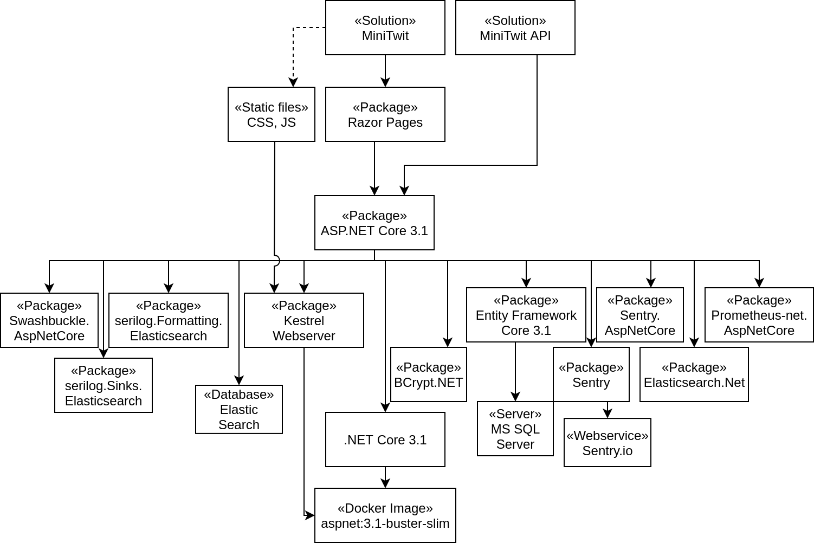

# Development Report
This document is the final report of Group b (2k20 MSc) for the *DevOps, Software
Evolution and Software Maintenance* course at IT University of Copenhagen, held in spring 2020.
It will detail the process of migrating the Minitwit platform, refactoring of the system,
major devops tasks we have done throughout the course, our team and repository organization and strategies.
Report is divided by sections, not by the timeline, so the reader can get better overview of our work.
We also argued for the choice of technologies and decisions we had made. At the end of the document,
we give a summary of what were our biggest issues and challenges, what we have learned out of that and what could have done better.

## Technology Stack
This chapter will introduce the technologies used during the development of the
application along with reasoning for the inclusion. The chapter ends with an
overview of the dependencies during design-time, and how they relate to each other
and external services implicitly required for them to function. The chapter is
structured in way that seeks to describe the foundation of all our technologies
and ending with external tools used during production of the application.

### Hosting
As the application should be publically available IP address we needed a hosting
provider for the production environment. The course presented [Digital Ocean][host-1] as an
option, and as a couple of us had prior experience with them we choose this solution.
The prior experience along with the option to utilize the [Github Student Developer Pack][host-2] 
for free credits meant we had confidence in the decision.

We started out provisioning a small [Droplet][host-3], which is what Digital Ocean names
their virtual private servers (VPS), with enough resources to host the application and 
the database inside Docker containers. However, when we added monitoring and logging to 
application we had increasing requirements for the specs of the VPS. To meet these
requirements we provisioned multiple Droplets as scaling a single VPS vertically would
introduce downtime, which we wanted to avoid.     

The result of this approach led us to having two Droplets; one for our tools (e.g.,
logging) and one for the solution. In retrospect this was probably the right
decision as it increases our resiliency. If one of the droplets crashes the other
one remains untouched.

Despite the short-term benefit of this solution we still have issues scaling the
droplet hosting the application. Because the application isn't stateless horizontal
scaling isn't an option, and thus vertical scaling is our sole option, which requires
us to incur some downtime when the droplet is upgraded.

[host-1]: https://www.digitalocean.com/
[host-2]: https://education.github.com/pack
[host-3]: https://www.digitalocean.com/products/droplets/

### Operating system
For the operating system of the application droplet we decided on Ubuntu 18.04.3 LTS.
It was important for us to use a version with long-term support (LTS) as it helps
us ensure stability and reliability as well as active support should bugs or 
security vulnerabilties surfaced during the course. 

We wanted to use a Linux based distribution as it seemed to provide the greatest
level of learning. Using Windows based virtual machine could provide us a graphical
user interface and tools, and it would definitely yield some valuable learning as well
it seemed a less attractive choice in the context of this course and tools we aimned
to utilize. The choice of Ubuntu is definitive as we could have used Arch Linux or 
any other distribution. However, Ubuntu is rather common and has a great community
making tools, which make it easier to figure out how tasks are done. These considerations
combined made Ubuntu an ideal choice for the members of the group that didn't have a
extensive experience with the OS and thus a more limited level of proficiency with it.

Due to the technologies we were planning on using (i.e., Docker) we weren't going to
be working too much directly on the operating system level. This meant that we didn't
require to have one of the group members focusing on the OS more than others. It also
proved to be a comfortable environment for the group members used to working in Windows.

### Containerization
To run the application and the database instance required by the application we decided
on the use of [Docker][container-1]. This choice rested primarily on it being presented 
in the course, but a more important fact was that all group members had interest in using
the technology, and a good introduction to the fundamentals around containers, which has 
broad applicability in other technologies such as Kubernetes.

In a professional context it might have been a better choice to use some
containerization-as-a-service solution or a provider where the features underlying
operating system support Docker is managed. Sticking with installing, configurating,
and operating Docker was a lot more involved than a managed solution in terms of
manual work, but it provided us with invaluable learning opportunities.

There are other alternatives to Docker, but it is the primary technology supporting
containerization and thus an unoffical standard in the business. An example of an
alternative is [Vagrant][container-2] used to provision the servers, but we deemed it less 
attractive as it is a rather heavy-weight solution (i.e., entire operating system) in order
to gain the same isolation Docker provides.

The technology we used to scale the system is [Docker Swarm][container-3]. This choice was 
primarily due to the providing all the features we required and having good integration with
Docker, which we already had invested in. To keep the setup simple we decided to run Docker 
Swarm with a single node (the original host machine) acting as both the  swarm manager and
sole worker node. We didn't invest much time looking into alternatives as Docker Swarm provided
all the tools necessary with less technical fragmentation, whereas an alternative would require
new configuration.

Using a single node did have the consequence of reduced reliability and scaling as we are
restricted to the amount of resources on the host. However, both of these concerns can be resolved
with the additional physical nodes in the future, which Docker Swarm simplifies greatly.

[container-1]: https://www.docker.com/
[container-2]: https://www.vagrantup.com/
[container-3]: https://docs.docker.com/engine/swarm/

### Programming language & Runtime environment
Before starting the refactoring of the existing MiniTwit application we considered our
options and interests of the group members in relation to the programming language we
aimed to use. This of course had an impact on our choices of web application frameworks
available to us.

We ended up using [.NET Core][prog-1] with C# as it was argued that it was the language 
that most of the group members would be able to write from the start. As mentioned 
a couple of times in previous sections we wanted to focus less on the development of
the application and more on setting up the DevOps tools and processing related to it, so 
chosing a completely new, and thus challenging language wasn't a priority.

The choice of the C# naturally led us to the usage of the [ASPNET Core][prog-2] web framework.This
framework provides us with good documentation on authoring both server-rendered pages
and REST APIs. For interaction with the database we decided to use an ORM rather than
handwritten SQL statements for reasons regarding both security and speed of development.
The choice of ORM ended on [Entity Framework Core][prog-3] as it integrates very well with ASPNET
Core, and has adapters to many different database giving us freedom in chosing our
storage solution later.

[prog-1]: https://dotnet.microsoft.com/
[prog-2]: https://dotnet.microsoft.com/apps/aspnet
[prog-3]: https://docs.microsoft.com/en-us/ef/core/

### Testing
To help increase our confidence in changes to the system we added unit tests. The
unit-tests are written in C# using the [XUnit][test-1] test framework, which is used to test 
functionality implemented in web application (e.g., creating a user, adding a message,
etc.).

The unit tests are focused around the service classes, which implements the business logic 
related to the main features of the system. These tests aims to exercise the "happy-path" 
of each feature, where the execution succeeds as well as the expected error paths (i.e., 
adding a message to an unknown user). The tests are executed using the built-in tooling 
of the [dotnet CLI][test-2] included in the .NET Core SDK.

We also wanted to test the API used by the simulator to make sure that this would work as
expected in accordance to the specification of the simulator. As the API is a boundary of
the application we also had the opportunity to use this as integration/system tests at the
same time. Therefore we provisioned a production-like setup using Docker Compose easily
and with confidence that is mimics the actual execution environment.

To ensure the simulator worked as expected we decided to run the provided reference
implementation of the simulator against our API. It is written is Python 3, so a member of
our group rewrote parts of it to convert into a simple test suite. This test suite is then
run against the API in our CI pipeline.

[test-1]: https://xunit.net/
[test-2]: https://docs.microsoft.com/en-us/dotnet/core/tools/

### Database
The storage solution started out using [SQLite][db-1], which was the original choice of the
application before refactoring. However, we wanted to use a more full-fletched database in
our production environment. This was motivated primarily by the learning opportunity of
operating a complex database system in production, and a wish to avoid the limitations of
SQLite with regards to query efficiency under load and lack of features for scaling and
backups.

To decided on the user of [Microsoft SQL Server][db-2]. This choice was motivated by our prior
investment into the .NET ecosystem, and the choice of Entity Framework as our ORM solution.
Despite the freedom of storage solution provided by the ORM is SQL Server a first-class
supported database as it also originates from Microsoft. The column data-types used in
T-SQL (which is the SQL dialect used in SQL Server) has direct translation to C# types, 
which provides us with confidence in the reliability during materialization of database
records not losing information (e.g., date-time or decimal precision).

We did consider other alternatives of relational databases, but ended up deciding on the
solution we had most confidence in, when the resource requirements of the alternatives
(e.g., [PostgreSQL][db-3], [MySQL][db-4] etc.) were very simlar. We didn't spend time looking into NoSQL
solution as we wanted an easy approach when migrating data from the existing SQLite 
database thus avoiding an ETL process of translating the database schema into a NoSQL
database. Lastly was most group members comfortable with relational databases.

[db-1]: https://www.sqlite.org/index.html
[db-2]: https://www.microsoft.com/en-us/sql-server/sql-server-2019
[db-3]: https://www.postgresql.org/
[db-4]: https://www.mysql.com/

### Monitoring
For the monitoring solution we decided on [Prometheus][mon-1] coupled with Grafana for visualization.
None of the group members had extensive prior experience with monitoring tools, which meant 
that we had no preferences. Taking a look at [Prometheus's own comparison to alternatives][mon-2]
(granted that it has a conflict of interests) made us comfortable that it would fit into the
setup we had planned due to Prometheus being designed to monitor metrics over time, whereas 
some of the alternatives (e.g., [InfluxDB][mon-3]) is more focused towards event logging, or has a
less feature complete query languages.

Another aspect which motivated this decision is good community support along with first-class
support for [.NET based integration][mon-4] from Prometheus themselves.

To ensure stability it was also important for us that Prometheus uses a pull-based model
when scraping metrics from the servers. The opporsite solution of a push-based solution
could prove problematic as the amount of data could overload the monitoring servers.

Integrating both Prometheus and Grafana proved to be simple due to the availability of 
pre-built container images, which integrated nicely with our investment into Docker.

[mon-1]: https://prometheus.io/
[mon-2]: https://prometheus.io/docs/introduction/comparison/
[mon-3]: https://www.influxdata.com/
[mon-4]: https://github.com/prometheus-net/prometheus-net

### Logging
Lastly is logging. We wanted to be sure we had an overview of the log messages produced by
our system, and any exception that might have occurred in production. The former is implemented
using Elasticsearch, Logstash, and Kibana (ELK stack). The ELK stack is a popular choice to 
structured logging with a large community supporting it. The community along with it being
presented during the course was the primary driving factors when deciding upon this solution.

A common theme throughout the development cycle has been ease of integration and the ELK stack
did deliver in that area. However, we did research other alternatives. This led us to looking more
closely into [LogDNA](https://logdna.com), which is Elasticsearch and Kibana combined. They also
support containerization, but suggests using Kubernetes, which we aren't using. The integration 
story with .NET is also another negative for this solution. We found a Github repository for a
[RedBear.LogDNA](https://github.com/RedBearSys/RedBear.LogDNA) library, but upon further study
it seemed to not be actively supported with few issues and pull requests. And the issues there was
mentioned deal-breaking issues related to crashes of the application utilizing the library.

To send structured logs to Elasticsearch we used the .NET based library [Serilog](https://serilog.net/)
which is also a popular choice in the .NET Core community, and it integrates very well with
ASPNET Core and Entity Framework Core using built-in logging interceptors gathering data
without any additional configuration. 

As mentioned in the start we also sought to gather exception from the production environment. For
this we ended up using [Sentry.io](https://sentry.io/welcome/). This was motivated primarily from
their ability to aggregate the exceptions, and provide metrics with regards to the number of users
affected by the exception, but also from prior experience from some of the group members.

### Dependency diagram
Having been through all the technologies used in the application we end the chapter with a diagram
of all the dependencies introduced and the relations between and any external services they rely on.

A noticable omission from the diagram is the technologies related to containerization and the 
technologies supporting that (i.e., the operating system). These has been omitted since they're
a prerequisite of the entire application, but doesn't play a role in the functionality of the 
application. The use of containers due add some constraints on the architecture of the application
with regards to scaling (e.g., horizontal scaling requires statelessness), however, this is discussed 
in the following chapter.

## System Description
*TODO - design and architecture of our ITU-MiniTwit system*

### Monitoring
*TODO - What do we monitor in our system*

### Logging
*TODO - what do we log and how we aggregate it*

### Scaling and load balancing
*TODO - Which strategy did we use for scaling and load balancing (ie. vertical vs. horizontal scaling)*

## CI/CD implementation
*TODO - complete description of stages and tools used in CI/CD chains (deployment and release)*

**Continuous Integration: Github Actions**
We initially looked at a variety of different CI possibilities, and considered
Jenkins for one, however we randomly looked at github and a group member
asked if any of us have every tried using Github Actions, their CI solution, and
we realized that neither of us had. This seemed like a great way to try
something new and it also seemed ideal with the current stack we were running. 
The choice was mainly based on this: the availability and the possibility to
learn something new. 

**Evaluation**
It was really neat having it integrate so smoothly with our pull request flow.

**Packaging & Docker image storage: Github**
Github has the possibility to host and provide packages for downloading, much
like Dockerhub. We considered moving our images to Dockerhub, but having in
centralized one place seemed ideal. We liked the idea of having a few select
services that we relied on, as to not create a too complex development flow, but
rather utilize few tools that integrated nicely together and provided each a
large chunk of the features required.

**Evaluation**
We had a few issues, especially that you [cannot download without being logged
in](https://github.community/t5/GitHub-API-Development-and/Download-from-Github-Package-Registry-without-authentication/td-p/35255),
which was rather tedious, but we overcame it by having one of our personal
tokens stored on the production site (which is less than ideal, but works).
Other than that it provided the features we needed. Looking at the features we
use, we would have gotten nothing more out of using Dockerhub, so having it all
centralized one place, packaging, repository & CI seemed like a neat choice, on
that we stand by.

**Continuous Delivery: Watchtower**
We needed our production server to automatically update whenever the master
branch updated on our repository - which was when ever a new version was
released on the packaging provider. There is a few different tools for this, and
this is something Jenkins does provide, however installing Jenkins for this
feature alone, seemed overkill and would use a magnitude more CPU power than we
wanted. So we found a service called Watchtower, which runs as a docker
container, and with with a consistant interval checks whether the remote image
has been updated - if it has, it updates the running container. 

**Evaluation**
It worked as expected and we didn't really touch it after installing it. This was
lightweight and provided exactly what we needed. Some critique can be made of
the service, as it in theory has access to the whole docker system, which might
be dangerous, and we are not exactly sure how it handles any errors in building
a new package, so it is probably more error prone, however it works for our
limited need. If we were to scale up and use this in a more system critical
setting, we would probably research this more, and find a enterprise grade
solution. Maybe even giving the github actions direct access to the Docker
service, and giving it the possibility to update the service directly from a
Github Action. We didn't do this initially out of fear for opening up our docker
host to the world, as that seemed relatively risky. However, with more research,
we could probably find a way to do this in a secure way.

## Development practices
*TODO - how do we interact? how is the team organized?*

*TODO - organization of our repository, branching strategy, process and tools (how do we use issues, tasks, kanban board)*

**Issue tracking / Kanban: Github**
Generally speaking we never really put much thought into how we would track
issues and how we would separate the tasks at hand. As we already had Github
open, we simply created all our tasks on the issue board there and never thought
about alternatives. 
Alternatively we could have created a Trello board or a Jira project, however
with the limited scope of the project it seemed extensive to include a whole
other system just for task management. As previously mentioned we generally
tried limiting the number of different tools we used, and create a stack with as
few different tools as possible.

**Evaluation**
We definitely had problems with our taskmanagement and ended up doing some of the
tasks too late, so we definitely had to change our workflow, and would have if
we could do it over. I think the main issue was that we didn't consult the issue
list often enough, and possibly didn't put deadlines on, as well as not
assigning people to issues. Ideally we should probably have improved our overall
development process earlier on, but this is covered in the [Post
Mortem](postmortem.md). We probably wouldn't have gotten any alternative
important features by choosing another service, as the problems we had were
based on structural team problems rather than the tool itself. Having the issues
closely aligned with the pull-request flow was definitely a helpful feature.

## State of solution
*TODO - current state of our system, results of static analysis and code quality assessment, add security assessment too*

## Conclusion and evaluation
*TODO - biggest issues, major lessons we have learned, overall takeaways, fuckups etc. regarding:*

**Containerization (Docker) Evaluation**
We would probably prefer having a more powerful host for the containers in the
future. If we had to scale vertically it would presumably be difficult, and this
is handled better in systems like Docker Swarm or Kubernetes. There are a large variety 
of different tools, which still builds on the Docker syntax, which has a more expansive
set of features, that would presumably handle scalability challanges better, however it
worked for the relatively small service that we had to provide - so in this context, it
was probably an ideal choice.

If we didn't want to focus on an approach that would provide us with a good learning
opportunity, we could have picked Azure and focus entirely on the application, as it 
integrates very well with the .NET environment supporting the application stack. Azure 
provides a lot of tools for a variety of requirements (e.g., logging). Whether using
Azure is ideal, however, is a matter of discussion in the group, and is based on both political and personal bias and opinions.

1. evolution and refactoring

**C#/ASPNET Core Evaluation**

> TODO: The first line kind of contradicts some of the content in the "Programming language"
section. I was under the impression that the use of C# worked out fairly well. However, if
this isn't the case please elaborate on this, and remember to change the programming
language section to fit this.

The team probably has varying opinions on the C# language, and some of use would
probably have preferred somewhat that was more engaging or faster to write,
however it got the job done, and it did make it easier to debug, leaving time
for writing various tests.

**Unit tests Evaluation**
The unit-tests are quick to run in the CI pipeline. However, the amount of code currently 
covered by the tests are limited to the primary functionality. This is, however, not a 
reflection of the choice of strategy, but rather an observation related to the available 
time we allocated to this part of the project. 

Some tests are without a doubt better than no tests, and we did catch some exceptions once in a while. Using the "happy-path" mentality strategy did catch the worst of errors however, meaning that it definitely added value to the project as a whole, however there is naturally always room for improvement. The focus did, however, mean that we tested wide to ensure all parts of the
application is exercised.

**Integration tests using an adapted simulator implementation**
This has so far proven to be a great choice. We haven't had to modify the files
yet, so the primary factor seemed to be development time, which was low, so the
choice seemed perfect.

**Database Evaluation**
The only problem we've had with this, was that a subset of our development team
continued to use SQLite for local testing, and SQLite has a more relaxed
relation to constraint, so some errors would occure in production that didn't
locally. However we fixed this by making it easier to spin up a MSSQL database
locally. 
However MSSQL in itself provided no problems - it had exactly the features that
we were after, and worked like a charm. This seemed to have been a good choice.

2. operation

**Docker Swarm Evaluation**
In accordance with your prior interest in Docker the choice of Docker Swarm was a
natural extension of this. The main hurdles encountered is the isolated knowledge 
of the technology. Due to nature of it we allocated a single person to set it up,
which meant that when an error was encountered by others in the group we didn't
have a clear picture. However, this can be helped by documenting the approach
taken and sharing lessons learned.

3. maintenance

* Link back to commit messages/issues to illustrate these. *

