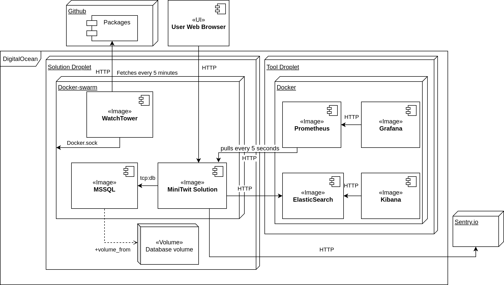
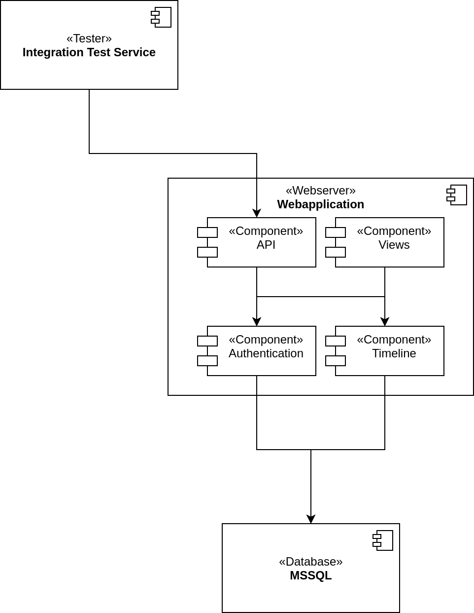
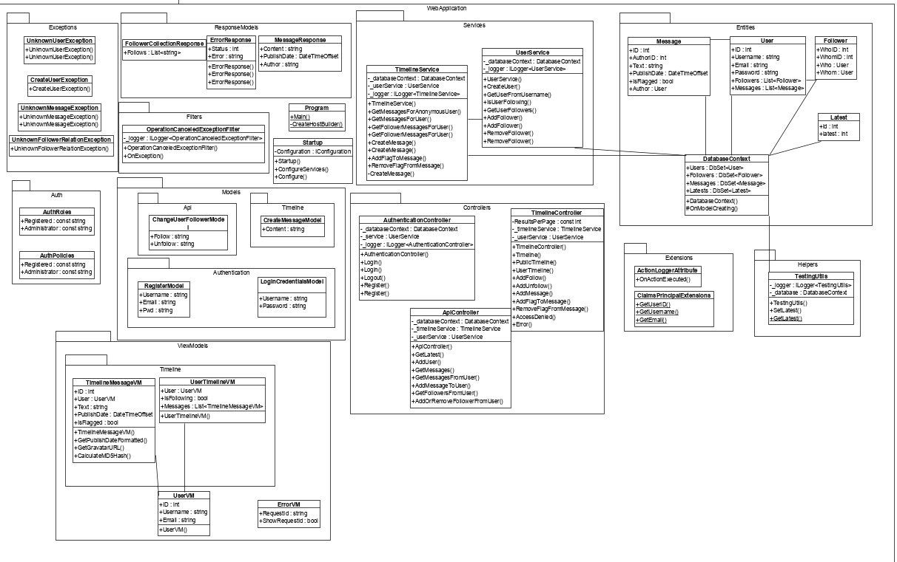
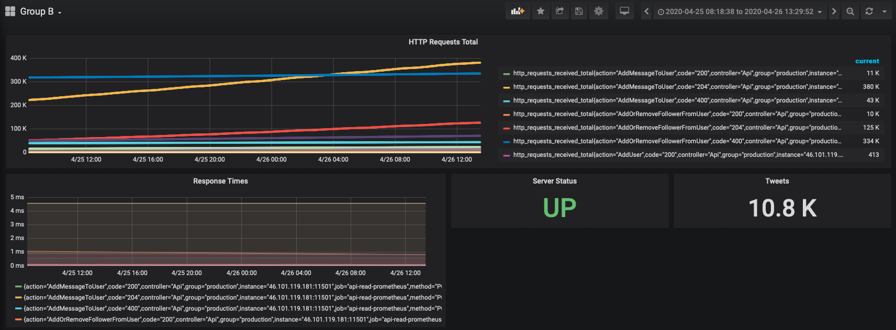
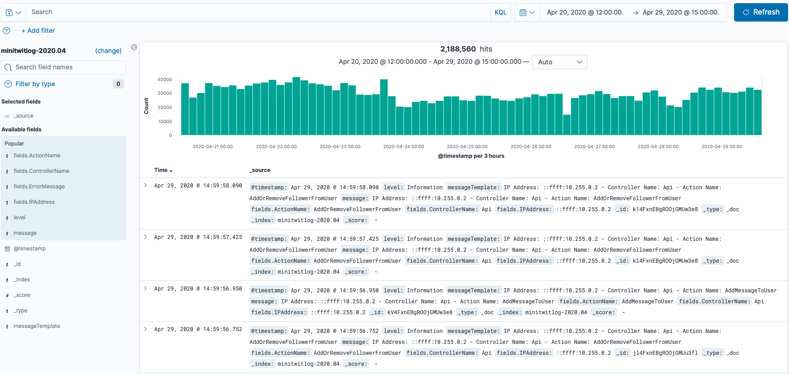
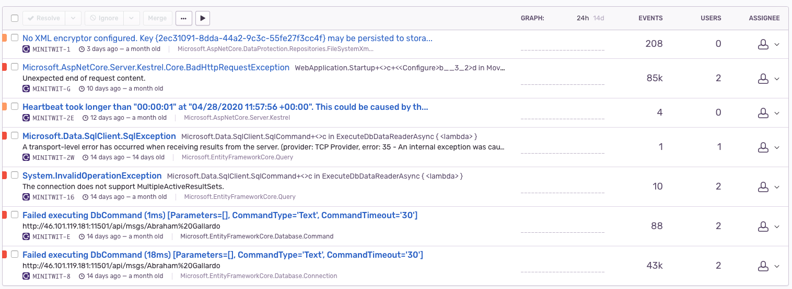
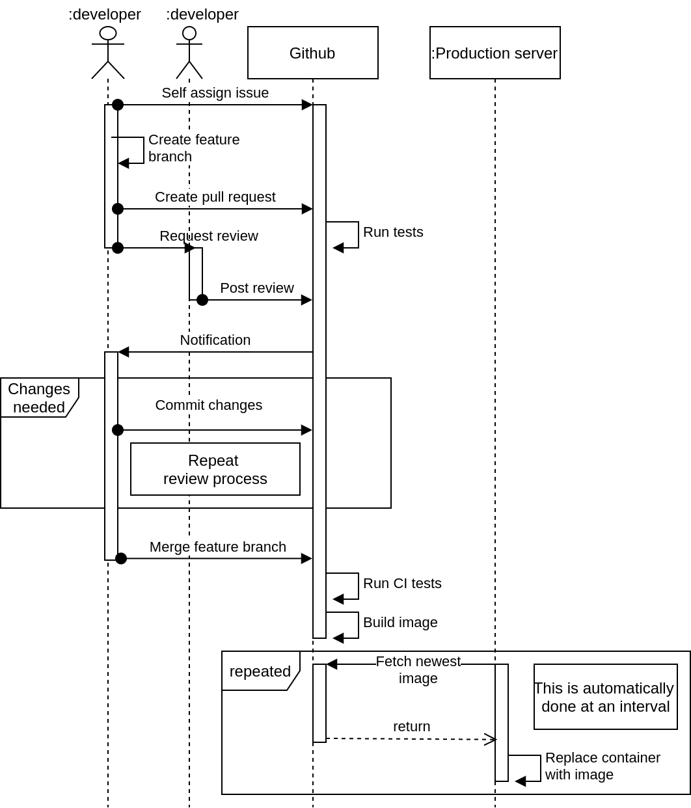
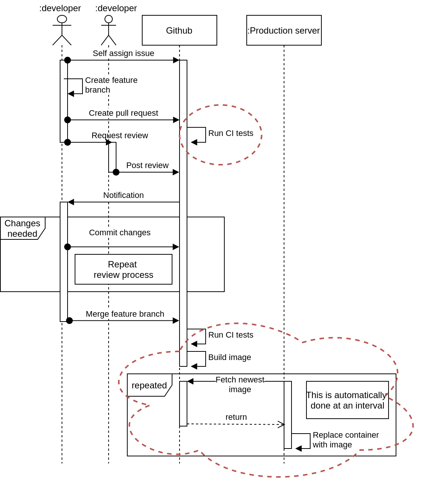

# Development Report

This document is the final report of Group b (2k20 MSc) for the _DevOps,
Software Evolution and Software Maintenance_ course at IT University of
Copenhagen, held in spring 2020. The course revolved around a simple social
network inspired by Twitter, called MiniTwit, written in the
[flask](https://flask.palletsprojects.com/en/1.1.x/) framework in python. This
process comprised of migrating and refactoring of the system as well as the
implementation and configuration of various DevOps tools. This report focuses on
the tools used and the reason for this, as well as the development practices
undertaken. It is expected that the reader knows the basic expectation of the
course and the goals - this report focuses not on the timeline nor overall order
of actions, but rather the specific choices and the reason for those choices -
additionally we will reflect on the choices, both regarding the effects it had
on this project as well as the takeaways we were left with regarding future projects.
The report first presents the technical stack, i.e. the tools and services
utilized, whereafter it goes through our development practices and the concrete
way these tools fitted into this context. Lastly we evaluate on all these
choices and tie it all together in a conclusion that, in broad terms, paints a
picture of the takeaways we were left with as a result of this course.

## Technology Stack

The MiniTwit solution is only a small part of the developed system, which
consists of various tools and utilities that improve the development flow,
monitoring, logging and performance of the MiniTwit application. The following
diagram, and sections shows how these services fit together and form the
architecture surrounding the solution. The diagram shows the type of
connections, as well as any relevant comment to that connection.



The following sections seek describe what each of these do, with reasoning for
the inclusion. The chapter ends with an overview of the dependencies during
design-time, and how they relate to each other and external services implicitly
required for them to function. The chapter is structured in a way that seeks to
describe the foundation of all our technologies and ending with external tools
used in the production environment of the application.

### Hosting

The application is required to have a publicly available IP address. Therefore
we needed a hosting provider for the production environment. The course
presented [Digital Ocean][host-1] as an option, and as a couple of us had prior
experience with this service we choose this solution. The prior experience, along
with the option to utilize the [Github Student Developer Pack][host-2] for free
credits, meant we had confidence in that decision.

We started out provisioning a small [Droplet][host-3], which is what Digital
Ocean names their virtual private servers (VPS), with enough resources to host
the application and the database inside Docker containers. However, when we
added monitoring and logging, we had increasing requirements for the specs of
the VPS. To meet these requirements we would either have to provision multiple
Droplets or scale the existing VPS vertically would introduce downtime, which we
wanted to avoid.

We decided to have two droplets; one for our tools (e.g., logging) and one for
the solution. In hindsight this was probably the right decision as it increases
our resiliency. If one of the droplets crashes the other one remains untouched.
These will be referenced as _Application Droplet_ and _Tool Droplet_, when
applicable.

Despite the short-term benefit of this solution we still have issues scaling the
droplet hosting the application. As the application isn't stateless, horizontal
scaling isn't an option, and thus vertical scaling is our sole option, which
requires us to incur some downtime when the droplet is upgraded.

[host-1]: https://www.digitalocean.com/
[host-2]: https://education.github.com/pack
[host-3]: https://www.digitalocean.com/products/droplets/

### Operating System

For the operating system of the application droplet we decided on Ubuntu 18.04.3
LTS. It was important for us to use a version with long-term support (LTS) as it
helps us ensure stability and reliability as well as active support should bugs
or security vulnerabilities surfaced during the course.

We wanted to use a Linux based distribution as it seemed to provide the greatest
level of learning. Using a Windows based virtual machine could provide us a
graphical user interface and tools, and it would definitely yield some valuable
learning as well, however it seemed to be a less attractive choice in the
context of this course and the tools we aimed to utilize. The choice of Ubuntu
is deliberate as we could have used Arch Linux or any other Linux distribution.
However, Ubuntu is the most common and has a great community, which make it
easier to debug and get support. These considerations combined made Ubuntu an
ideal choice with a group of varying levels Linux experience, and thus a more
limited level of proficiency with it.

### Containerization

To run the application and the database system, we decided on the use of
[Docker][container-1]. This choice rested primarily on it being presented in the
course, but a more important fact was that all group members had interest in
using the technology, and wanted some essential understanding of containers,
which has broad applicability in other similar technologies, for instance
Kubernetes.

There are other alternatives to Docker, but it is the primary technology
supporting containerization and thus an unofficial standard in the business. An
example of an alternative is [Vagrant][container-2] used to provision the
servers, but we deemed it less attractive as it is a rather heavy-weight
solution (i.e., entire operating system) in order to gain the same isolation
Docker provides.

We used [Docker Swarm][container-3] to horizontally scale the system. This
choice was primarily due to it providing all the features we required and
already being part of the Docker ecosystem, which we already had invested in. To
keep the setup simple we decided to run Docker Swarm with a single node (the
original host machine) acting as both the swarm manager and sole worker node. We
didn't invest much time looking into alternatives as Docker Swarm provided all
the tools necessary with less technical fragmentation, whereas an alternative
would require new configuration.

As mentioned the aim is to horizontally scale the application. We deemed this to be
the best solution as the application is focused on serving multiple clients with rather
inexpensive CPU and memory requirements. Because each request doesn't require 
as many resources to be available is the argument for vertical scaling on each node
rather moot. The use of multiple nodes in turn would mean a higher limit to the
number concurrent connections from clients.

Using Docker Swarm simplifies the load-balancing aspect of this strategy as
swarm mode has a built-in balancer for ingress connections, and automatically
distributes the connections between the nodes available using a round-robin
fashion.

[container-1]: https://www.docker.com/
[container-2]: https://www.vagrantup.com/
[container-3]: https://docs.docker.com/engine/swarm/

### Programming language & Runtime environment

Before starting the refactoring of the existing MiniTwit application we
considered different programming languages, as well as the interests of the
group members regarding this decision. This of course had an impact on the
possibilities regarding web application frameworks.

We ended up using [.NET Core][prog-1] with C# as it was argued that it was the
language that most of the group members would be able to write from the start.
We wanted to focus less on the development of the application and more on
setting up the DevOps tools and processing related to it, so choosing a
completely new, and thus challenging language wasn't a priority.

The choice of C# naturally led us to the usage of the [ASPNET Core][prog-2]
web framework.This framework provides us with good documentation on authoring
both server-rendered pages and REST APIs. For interaction with the database we
decided to use an ORM rather than handwritten SQL statements for reasons
regarding both security and speed of development. The choice of ORM ended on
[Entity Framework Core][prog-3] as it integrates very well with ASPNET Core, and
has adapters to many different databases, giving us freedom in the choice of
storage solution.

[prog-1]: https://dotnet.microsoft.com/
[prog-2]: https://dotnet.microsoft.com/apps/aspnet
[prog-3]: https://docs.microsoft.com/en-us/ef/core/

### Database

Initially the system utilized [SQLite][db-1], which was the original choice of
the application before refactoring. However, we wanted to use a more
fully-fledged database in our production environment. This was motivated
primarily by the learning opportunity regarding the operation of a complex
database system in a production environment. On top of this we had a variety of
limitations regarding SQLite regarding query efficiency under load and lack of
features for scaling and backups.

We decided on the use of [Microsoft SQL Server][db-2]. This choice was motivated
by our prior investment into the .NET ecosystem, and the choice of Entity
Framework as our ORM solution. The ORM provided a freedom of storage solution,
however the ORM still sees the SQL Server as a first-class supported database as it
also originates from Microsoft. The column data-types used in T-SQL (which is
the SQL dialect used in SQL Server) has direct translation to C# types, which
provides us with confidence in the reliability during materialization of
database record (e.g., not losing date-time or decimal precision).

We did consider other alternatives of relational databases, but ended up
deciding on the solution we had most confidence in. Alternatives like
[PostgreSQL][db-3] and [MySQL][db-4] were very similar, had similar hardware
requirements, and provided no extra relevant functionality. We didn't spend time
looking into a NoSQL solution as we wanted an easy approach when migrating data
from the existing SQLite database thus avoiding an ETL process of translating
the database schema into a NoSQL database. Lastly was the motivation that most
group members were comfortable with relational databases.

The database itself, is mounted in a docker volume, to provide persistence even
upon a crash or restart, which normally would not be the case as containers are
non persistent by design.

[db-1]: https://www.sqlite.org/index.html
[db-2]: https://www.microsoft.com/en-us/sql-server/sql-server-2019
[db-3]: https://www.postgresql.org/
[db-4]: https://www.mysql.com/

### Monitoring

For the monitoring solution we decided on [Prometheus][mon-1] coupled with
Grafana for visualization. None of the group members had extensive prior
experience with monitoring tools, which meant that we had no preferences. Taking
a look at [Prometheus's own comparison to alternatives][mon-2] (granted that it
has a conflict of interests) made us comfortable that it would fit into the
setup we had planned. Primarily, Prometheus being designed to monitor metrics
over time, whereas some of the alternatives (e.g., [InfluxDB][mon-3]) is more
focused towards event logging, or has less feature complete query languages.

Another aspect, which motivated this decision, was good community support along
with first-class support for [.NET based integration][mon-4] from Prometheus
themselves.

To ensure stability it was also important for us that Prometheus uses a
pull-based model when scraping metrics from the servers. The opposite solution
of a push-based solution could prove problematic as the amount of data could
overload the monitoring servers.

Integrating both Prometheus and Grafana proved to be simple due to the
availability of pre-built container images, which integrated nicely with our
investment into Docker.

[mon-1]: https://prometheus.io/
[mon-2]: https://prometheus.io/docs/introduction/comparison/
[mon-3]: https://www.influxdata.com/
[mon-4]: https://github.com/prometheus-net/prometheus-net

### Logging

We wanted to be sure we had an overview of the log messages produced by our
system, and any exception that might have occurred in production. This provides
two distinct problems, which will be covered here.

#### Event Logging

Event Logging is implemented using Elasticsearch, Logstash, and Kibana (often
called the ELK stack). The ELK stack is a popular choice to structured logging
with a large community supporting it. The community along with it being
presented during the course was the primary driving factors when deciding upon
this solution.

A common theme throughout the development cycle has been ease of integration and
the ELK stack did deliver in that area. However, we did research other
alternatives. This led us to looking more closely into
[LogDNA](https://logdna.com), which is Elasticsearch and Kibana combined. They
also support containerization, but suggests using Kubernetes, which we aren't
using. The integration story with .NET is also another negative for this
solution. We found a Github repository for a
[RedBear.LogDNA](https://github.com/RedBearSys/RedBear.LogDNA) library, but upon
further study it seemed to not be actively supported with few issues and pull
requests. And the issues there were mentioned deal-breaking issues related to
crashes of the application utilizing the library.

To send structured logs to Elasticsearch we used the .NET based library
[Serilog](https://serilog.net/) which is also a popular choice in the .NET Core
community, and it integrates very well with ASPNET Core and Entity Framework
Core using built-in logging interceptors gathering data without any additional
configuration.

#### Exception Logging

As mentioned in the start we also sought to gather exception from the production
environment. For this we ended up using [Sentry.io](https://sentry.io/welcome/).
This was motivated primarily from their ability to aggregate the exceptions, and
provide metrics with regards to the number of users affected by the exception,
but also from prior experience from some of the group members. This was a
relatively simple choice, and provided quick setup as well as an easy to read
interface. Additionally utilizing a managed solution, made sure that it wouldn't
crash or fail, which was crucial when considering the various bugs we would
accidentally introduce in our production environment. We could potentially
extract these from the ELK stack, but this was easy to setup and extract data
from, making it an ideal choice.

### Solution Implementation

Having been through all the technologies used it is still important to see how
these relate to the solution itself - the MiniTwit application. On top of this,
it is also important to highlight and explicitly state the structure of the
created solution.

#### Components

The following diagram shows the various internal components of the system. The
component diagram does not follow UML syntax, however the arrows symbolize an
dependency relation. The diagram is simple in nature, which is caused by the
simplicity of the problem as well as the solution to that problem. The system
didn't have a large level of modularity, so we have a low component count.



The concerns of the components are as follows:

**API** focuses on the handling of API requests and is the external interface to
the system. **Views** handles rendering of the website and the various webpages
through HTML - it is also concerned with any form request made on the website.
**Authentication** handled user types signup and login functionality. We created
two user types; administrator and user, where administrator had the possibility
to flag various messages. **Timeline** handled everything message related - the
creation and viewing of messages.

#### Dependencies

This, however, only looks at the internal view of the solution. The end solution
depended on a variety of different external frameworks, packages and services.
The following diagram shows these relations.


A noticeable omission from the diagram is the technologies related to
containerization and the technologies supporting that (i.e., the operating
system). These have been omitted since they're a prerequisite of the entire
application, but don't play a role in the functionality of the application.
These, however, should be obvious by viewing the Deployment diagram.

#### Classes

The concrete implementation is constructed in C# - it being a an object-oriented
language, means that it makes sense to look at the class diagram, as it shows
the software implementation itself and how it fits into the different
aspects of the MinitTwit application.



Looking at the diagram some noticeable classes include the controllers: _ApiController_ 
and _TimelineController_. The former handles all interaction with the simulator, while 
the latter handles the primary functions of the server-rendered HTML pages. The diagram
also include service classes responsible for the user related features (e.g., creating
and followers) and the timeline service related to message creation and flagging. These 
services implement the business logic, and communicates with the _DatabaseContext_ class 
to persist data to the database. Another interesting class is the _ActionLoggerAttribute_
defined in the _Extensions_ namespace. This classes is instrumental in collecting usage
metrics and information logged to Kibana through the structured logging library Serilog.

## Monitoring & Logging Strategies

There is a large variety of ways to utilize both monitoring and logging. This
section will focus on how we did this, and for what reasons.

### Monitoring



Our way of monitoring was proactive with Prometheus collecting metrics and
Grafana for the overview through a dashboard. It was more application-centric
where we measured:

- response times
- the number of HTTP requests in total
- whether the application was up.

Primarily, the focus was on the [SLA](../SLA.md) and comply with the
requirements we set forth.

Whitebox monitoring was also useful to us as it enabled us to focus on what's
inside the system. We exposed the metrics that we wanted, and utilized
Prometheus to pull these metrics into our monitoring/logging system. We made an
extra metric that would count requests for each endpoint and return which method
that had been called. In a real-life system, it is proven useful to know which
page or part of the system that gets visited the most for a variety of reasons.
It can give insight in how the system is used, but also potential bottlenecks
and areas where performance improvements are of higher importance. We used
active monitoring to determine whether our system was up or down. Active
monitoring also enabled us to actively validate our SLA compliance.

### Logging

The following image shows a screenshot of the available information exposed by Kibana.
On the top we can see the total amount of requests over time, where each block
symbolizes a 3 hour timeslot. Below we can see a live timeline of events logged
in the system. Worth noting is the powerful querying engine that is accessible
in the left side of the screen. This makes it easy to find specific entries
throughout recorded history.



The logs were sent from our application to ElasticSearch that is on our other
server.

The different log levels that we include are:

- Debug
- Information
- Warning
- Error
- Fatal

We logged IPAddress, ControllerName, ActionName, and the ErrorMessage if there
had been an error.

We made the minimum level for log event processing to
[Information](https://github.com/serilog/serilog/wiki/Configuration-Basics)
which means it describes things that happened in the system which corresponded
to its responsibilities and function.

The exposed information, however, was insufficient to do error logging, and find
fully understand both stacktraces and extract the required information to
reproduce and solve errors. This could presumably be configured, however we chose
to use [Sentry.io](https://sentry.io/welcome/) for error logging. Sentry.io
provides a great level of information and provides an easily viewable
stacktrace. Additionally we had various things like email notification
out-of-the-box. This provided a large set of capabilities without spending too
much time on setup.



We ended up utilizing Kibana for event logging and Sentry.io for error logging.

## Development practices

With the Covid-19 epidemic emerging approximately half-way through the course,
the interaction amongst us inevitably changed as it was unwise to meet
physically. Initially when the course started, we would hold a meeting after the
lecture to plan the steps which needed to be accomplished for the following
weeks release.

As Covid-19 progressed, ITU closed down, and gatherings became rightfully
frowned upon which forced us to settle for the suboptimal approach of talking
over Zoom. While the content of these meetings were almost identical to that of
our physical meetings, the overhead of technical issues involving subpar
microphones and internet connections made these meetings far less efficient.
These meetings over Zoom took place approximately once every week. Meetings over
Zoom weren’t always necessary, which is why we also used Slack to keep each
other updated on progress on issues as well as to ask for consent to make
changes to the system or to ask for help.

The typical output of the meetings was an understanding of what tasks needed to
be carried out and by whom. These tasks would be posted as issues on Github,
where a group member would assign themselves to it. Using Github issues rather
than other tools, was an easy choice for us as it provided the functionality we
needed while also minimizing the spread of tools we used, seeing as we also used
Github for version control.

The vast majority of the issues were handled independently without pair
programming, which is definitely something we should have done in hindsight, as
mistakes could have been avoided and knowledge of more intricate details in our
program could be shared more conveniently. Although we didn’t define any clear
roles for the group members, the lack of pair programming resulted in some
intrinsic roles when the issues were perhaps larger than they should have been.
Being more consistent with creating smaller issues, could have solved this
problem, as multiple people would then have the opportunity of working on the
same subsystem.

The following diagram shows our development flow.



When working on an issue that is some new feature in the project, we created a
new branch to work on it in a separate environment. Once the issue was deemed
complete, a pull request was made to finally merge the new feature into the
master branch. This branching strategy is very much in line with the ‘Topic
Branches’ model where branches are short-lived and become merged with the master
branch once the feature is working as intended. The exact reasoning for this model
was somewhat coincidental, and happened as a result of the way we used issues.

### Issue tracking / Kanban: Github

Generally speaking we never really put much thought into how we would track
issues and how we would separate the tasks at hand. As we already had Github
open, we simply created all our tasks on the issue board there and never thought
about alternatives. Alternatively we could have created a Trello board or a Jira
project, however with the limited scope of the project it seemed extensive to
include a whole other system just for task management. As previously mentioned
we generally tried limiting the number of different tools we used, and create a
stack with as few different tools as possible.

## CI/CD Pipeline

Having a strong CI/CD pipeline is a crucial development step in an agile
development team. Having automated deployment removes operations time from
having to manual deploy to production, it also limits potential errors.
Combining that with a variety of automated tests, makes sure that our production
environment is as close to perfect as possible. This, however, depends on the
quality of the tests and the various tools utilized.

This section will go through the choices we made relating to the pipeline, and
how it integrated in our workflow.

To understand the pipeline, it is first important to understand the context.
Here is the development diagram with the CI/CD steps highlighted.



The pipeline is only a small part of the development flow, however, done
correctly, it increases the effectiveness many-fold.

### Continuous Integration

After any commit is pushed to the remote repository, the CI tests check if the
new feature introduces any regression, and if code quality is of satisfactory
levels. This is an important part of our review process of each feature - this
alleviated some pressure from the peer-reviewer, making it easier to trust that
the feature did not break anything - this cut down on time spent on reviews,
leaving room for developing features and operations.

#### Github Actions

Continuous integration required the ability to run a variety of scripts,
essentially, whenever a new commit enters the repository. We initially looked
at a variety of different CI possibilities, and considered Jenkins for one,
however we randomly looked at github and a group member asked if any of us have
every tried using Github Actions, their CI solution, and we realized that
neither of us had. This seemed like a great way to try something new and it also
seemed ideal with the current stack we were running. The choice was mainly based
on the availability and the possibility to learn something new.

We created three Github Action, whereas the following file is related to the
automated tests:

```YAML
name: Automated Tests

on: [push]

jobs:
  build:

    runs-on: ubuntu-latest

    steps:
    - uses: actions/checkout@v2
    - name: Setup .NET Core
      uses: actions/setup-dotnet@v1
      with:
        dotnet-version: 3.1.100
    - name: Run integration tests
      working-directory: ./src/
      run: docker-compose -f docker-compose.test.yml up --build --exit-code-from tester
    - name: Run unit tests
      run: dotnet test
      working-directory: ./src/WebApplication.Tests
```

#### Unit tests

To help increase our confidence in the changes added to the system we added unit
tests. The unit-tests are written in C# using the XUnit test framework, which is
used to test functionality as implemented in web application (e.g., creating a
user, adding a message, etc.).

The unit tests are focused around the service classes, which implement the
business logic related to the functionality of the system. These tests aims to
check the "happy-path" where the function succeeds as well as the expected error
paths (i.e., adding a message to an unknown user). The tests are executed using
the built-in tooling of the dotnet CLI included in the .NET Core SDK.

These tests are run as part of the CI pipeline on pull requests (PR), and when a
PR is merged into the master branch.

#### Integration tests

We wanted to test the API used by the simulator to make sure that this would
continue to work - Also as this surface is an API it is easier to test than a
graphical user interface, so we would be able to test all backend functionality
relatively easy.

The simulator that had to interface with our service was already written in
python3, so testing if the simulator would be able to work, would, in theory, be
as simple as running the simulator on a clean database, and see if the simulator
failed. It would still have to be rewritten a bit though.

As a member of our team has worked with python professionally for multiple years
he proposed he would convert it into unit tests. This made it somewhat easy to
isolate where errors occurred if something failed within this tester.

### Continuous Delivery

When new commits enter the master branch, we need to update the production
server. The alternative would be to manually connect to the production
environment and pull the newest version of the system. This takes time and is
error prone, therefore this flow is automated. This is, in our case, done by
releasing a version of the code, organized by a docker image, to a package host,
which could then be downloaded by our production server.

**Github, as a packaging host**, has the possibility to host and provide
packages for downloading, much like Dockerhub. We considered moving our images
to Dockerhub, but having packages stored the same place as storing the
repository seemed ideal. We liked the idea of having a few select services that
we relied on, as to not create a too complex development flow, but rather
utilize few tools that integrated nicely together and provided each a large
chunk of the features required.

**Our github action**, automated the creation of the docker image as well as
pushing the image to the packaging host, seen
[here](https://github.com/Trivivium/devops-2k20/blob/master/.github/workflows/dockerpush.yml).
When pushed, the latest release can be accessed
[here](https://github.com/Trivivium/devops-2k20/packages/133732).

We had an [additional
action](https://github.com/Trivivium/devops-2k20/blob/master/.github/workflows/release.yml)
to create release [tags](https://github.com/Trivivium/devops-2k20/releases).

Upon the package being pushed to the packaging host, the next step is for the
production environment to pull the image.

**Watchtower** is a tool that automatically updates the base image of Docker
containers, which can be found [here](https://github.com/containrrr/watchtower).
There are a few different tools for this, and this is something Jenkins does
provide, however installing Jenkins for this feature alone, seemed overkill and
would use a magnitude more CPU power than we wanted. We wanted to utilize a
minimal amount of tools that provides what was needed, and nothing else. This is what
watchtower did. It checks your package host with a consistant interval checks
whether the remote image has been updated - if it has, it updates the running
container. The setup was really simple, here showing the full configuration in
our `docker-compose`
[file](https://github.com/Trivivium/devops-2k20/blob/master/src/production.yml):

```yml
watchtower:
  image: v2tec/watchtower
  volumes:
    - /var/run/docker.sock:/var/run/docker.sock
    - /root/.docker/config.json:/config.json
  command: --interval 300
```

Worth noting, however, is that Watchtower does this by connecting to the docker
socket, making it able to spy on and interact with all running containers. This
is naturally dangerous if there is a security bug in watchtower, or if it is in
any way acts maliciously. We, however, trusted the service in the context of
this course, but that is a security estimate that should be considered in
projects.

The push step is easily visualized on the repository, making it transparent
whether the package creation was successful, however we have no way to monitor
whether the production is updated, nor the version of the software is running,
other than SSH'ing into the production server and checking.

## Quality Assessment

In an evolving IT system, it is important to consider technical debt and the
quality of the work, as this can inhibit the development speed massively.
Various automated tools can assess the quality of your software solution, which
will catch a variety of a generic code-quality problems, as well as suggest
improvements. Certain problems naturally exist with automated tools - at times
they will be over sensitive and report errors that are acceptable in context,
however they will also have miss some structural issues that can be difficult to
automatically detect.

This chapter will go through how we can assess the quality of our system, both
automatically but also manually.

We have chosen [BetterCode](https://bettercodehub.com) as our Software Quality
Assessment Tool and included it in our CI/CD pipeline. With this tool, we can
measure the characteristics of system components and then aggregating these
measurements. The measurements can be used to assess system quality attributes,
such as maintainability, and system components whose characteristics deviate
from that.

Other than scoring our quality it also prioritizes the code that we need to work
on first. BetterCode gave us an 8/10 compliance score, which is good, however
far from perfect, and signals areas in which improvement should be considered.

### BetterCode assessments

The following section goes through the reasoning for the 8/10 score, and covers
the considerations to be made in relation to our system.

#### Write Short Units Of Code


To get a higher score BetterCode recommends that we take a look at LOC(Lines of
Code) in our methods. [LOC](https://en.wikipedia.org/wiki/Source_lines_of_code)
is sometimes used as a metric for software complexity, as small methods are
easier to understand, reuse and test. A large LOC can be an indication of
importance or complexity, but also methods that have not been maintained for a long
time.

The picture shows a list of files in which there is a method that violates the
guideline. The `.sh` file is used in our docker-compose files, to ensure that
all components are successfully running. The other methods mainly consist of
configuration methods or important parts in our system. The guideline from
BetterCode is at most 15 lines of code in a method.

#### Write Simple Units of Code


The guideline explanation is mainly keeping the number of branch points (if,
for, while, etc) low. The reason being that it makes units easier to modify and
test.

Once again it is the same `.sh` that is a rather complex unit. `ApiController`
is the class that draws the most of our attention as it is part of a component in
our MiniTwit solution. The highlighted method in `ApiController` does not have
that high of severity which is fine.

#### Write Code Once


This is basically the _Don't Repeat yourself_ principal.

When code is copied, bugs need to be fixed in multiple places. Avoid duplication by
never copy/pasting blocks of code. Instead, do reduce duplication by extracting
shared code into a new method or class.

At this point we only have two cases of duplication - this amount is indicated
to be acceptable by BetterCode. This is also one of the easiest problems to fix.

#### Keep Unit Interfaces Small


This states that keeping the number of parameters low, makes methods easier to
understand and reuse.

One way to improve this is that the number of parameters can be reduced by
grouping related parameters into objects.

Our most severe is a constructor that creates a TimelineMessage. If we wanted to
reduce this even further, we can make a new Message class and group related
parameters in that class.

#### Separate Concerns in Modules


It is mainly concerned with keeping the codebase loosely coupled, as it makes it
easier to minimize the consequences of changes.

Identify and extract the responsibilities of large modules to separate modules
and hide implementation details behind interfaces.

BetterCode is giving us full points for this.

#### Couple Architecture Components Loosely


This focuses on us having a loose coupling between top-level components, which
makes it easier to maintain components in isolation. Another point is that
independent components ease isolated maintenance.

#### Keep Architecture Components Balanced


Balancing the number and relative size of components makes it easier to locate
code. Even though BetterCode states that we are doing fine, we have to keep
the number of components between 2 and 12. By doing this, it should be easier to
find the piece of code that we want to change.

#### Keep Your Codebase Small


If we keep our codebase small it will improve maintainability, as it takes less
work to make structural changes in a smaller codebase.

BetterCode prefers that we use 3rd party libraries and frameworks over reinventing the
wheel. It measures us based on how many years it would take a person, with
approximate effort, to rebuild our version of MiniTwit.

#### Automate Tests


Having automated tests for our codebase makes development less risky - it
reduces the chance of regression, and can also improve readability in that it
provides clear simple examples of the usage of various components. Based on the
numbers we could have done lot more of excessive testing. 80% had been more
acceptable from our side. Another important point is that when we adjust code in
our system, then the changes should be reflected in the tests as well.

#### Write Clean Code


BetterCode highlights Code Smells, which is various coding anti-patterns, that
can hint at the existence of a problem. They state that it improves
maintainability because clean code is maintainable code.

Our results being that we have left some `TODO` comments in our code, and they
should be fix or removed if they are outdated.

### State Of MiniTwit

The assessment of software quality is a subjective process where we have to
decide the quality, the metric and an acceptable level of quality. Assessing the
quality of our system is no exception.

BetterCode essentially focuses on maintainability, which is naturally something
we deem very important in an agile development team, where we have to move
quickly and have a high level of transparency. We had not formally agreed, prior
to looking at these results, what an acceptable level would be. However we deem
any value of 7 or above acceptable.

The state of the system can also be seen from a security point of view. From our
security assessment, which is detailed in the [postmortem](../POSTMORTEM.md), we
realized that we are storing several passwords in our source code. The admin
password to the database can be found in both our docker-compose file, as well
as our source code. Additionally, passwords to our admin user are visible in the
source code, as well as passwords to our logging tools. This would, in theory,
be acceptable if these can be changed in deployment, and regarding the admin
user password, if it is possible to change via the user interface. This,
however, is not the case. That is a huge security flaw and can have severe
consequences. We should have implemented a change-password functionality as well
as store all external authorization credentials via environmental constants.

Looking at the state of our system from a security perspective, highlights the
fact that our system is inadequate. This is definitely the primary focus in any
future development process had that been the case. We, however, are satisfied
from a code quality perspective.

## Evaluation

Here we list some of our biggest issues, lessons we have learned, overall
takeaways as well as some minor mistakes we had made that caused us troubles and
inconveniences.

### Application Development

During the development of the application we encountered a couple of issues that
should have been mitigated as researched beforehand, and a couple of noticeable
features could use some improvements to increase ease of development.

#### Use of SQLite during development

The first issue encountered was the use of SQLite for local development. Due to
the overhead of building and orchestrating containers every time the developer
wanted to debug the application we had initially decided to use SQLite. This
choice worked well for the intended purpose, but did prove to be a source of
errors. The issue stems from the fact that SQLite lacks some of the features
related to constraints which the fully-fletched database server had. Thus when
the developer tested any changes made the SQLite provider would be more
permissive than the production environment. We encountered this exact issue
early on and decided to move away from SQLite entirely by provisioning a MS SQL
Server Docker image for local development.

#### Database Migrations

The second issue we encountered was also related to the database. Using Entity
Framework Core provides us with the option of using Database Migrations to
deploy database changes automatically during start-up of the application.
However, this requires us to opt-in to this technology from the start, which we
didn't. This had to consequence that database changes had to be considered
carefully, and was often worked around, as they would require manual
intervention. The key learning from this is the importance of having a plan for
updates to the database structure before launching the application in a
production environment.

#### Hardcoded sensitive information

The third issue was reported as part of the security review of our system. The
report pointed out that we had sensitive information such as usernames/passwords
in cleartext in the source code. This involved components such as the database,
logging etc. This was an embarrasing issue and the group was in agreement that
this should have been considered from the start. We decided on the solution of
storing the secrets using environment variables, where tools such as Docker
secrets (for production) and ASPNET Core secrets (for development) would provide
means to store these separately from the code.

### Operation

This section focuses on the operational level of the system, and what we learned
from this. This entails the production environment and monitoring/logging of
these things, as well as the setup of these things. Overall, these are the
things we had the lowest level of prior understanding of, making it one of the
most interesting learning experiences.

#### Containerization

The choice of manually installing, configuring, and operating Docker was a lot
more involved than a managed solution in terms of manual work, than many of the
managed alternatives, but it provided us with invaluable learning opportunities.
The setup process was interesting and we were able to learn various things about
the inner workings of docker, however it did leave space for the potential for
errors in critical components of the application, such as [database
deletion](https://github.com/Trivivium/devops-2k20/issues/50).

In accordance with our prior interest in Docker the choice of Docker Swarm was a
natural extension of this. The main hurdles encountered is the isolated
knowledge of the technology. Due to nature of it we allocated a single person to
set it up, which meant that when an error was encountered by others in the group
we didn't have a clear picture. However, this can be helped by documenting the
approach taken and sharing lessons learned.

Using a single node did have the consequence of reduced reliability and scaling
as we are restricted to the amount of resources on the host. However, both of
these concerns can be resolved with the additional physical nodes in the future,
which Docker Swarm simplifies greatly.

Due to hurdles and errors encountered, we would probably use a service provider
for this instead, in other cases. Be it Heroku, AWS or Azure, they all provide a
great ecosystem for these things, and reduce the risk of errors, and reduce
configuration time. This is naturally a tradeoff, and depends on the context in
which the development is taking place - having full control of your stack does
have it's advantages, however in projects of this size and type, it provides a
massive overhead.

With that being said, the choice was still great from a learning perspective.

#### Operating System

The operating system didn't seem to be crucial. The majority of our development
was in config files, and the challenges we would have required only a low level
Linux proficiency, however having an entry-level distribution did make it easier
to debug the various issues we would come across. Due to the technologies we
were planning on using (i.e., Docker) we weren't going to be working too much
directly on the operating system level. This meant that we didn't require to
have one of the group members focusing on the OS more than others. It also
proved to be a comfortable environment for the group members used to working in
Windows.

#### Exceptions

We didn't have exception logging from when the application initially launched.
This meant that we had a couple of days with downtime once in a while, without
realizing it till it was too late. As mentioned previously we ended up utilizing
Sentry.io to solve this problem. However we had already missed a lot of user
registrations when the simulator started. This had the consequence of us
receiving many more errors due to the simulator attempting to create messages
for non-existing users. The key learning opportunity here is the importance of
logging unhandled exception in production environments.

The bulk of these exceptions occurred before the introduction of a service level
agreement (SLA). However, considering the points in the SLA being important at
any stage in the process the exception did have the consequence of us breaking
the terms we defined. More specifically is the average number of errors pr. hour
violated a few times, and the mean recovery time is challenged too. This
emphasizes the importance of logging all errors from the start and tracking the
rate of them.

#### Storing authentication signing keys inside containers

Due to the continuous delivery aspect of our deployment pipeline the running
container image was replaced often. This however had the side effect of wiping
out any current authenticated user sessions. The cause of this issue was due to
the fact that signing key used for authentication tokens was persisted in a
directory inside the container. We discovered this quite late in the process,
but managed to solve this by moving the directory to a mounted Docker volume.

The key learning here is the importance of knowing exactly what is stored inside
the containers, and testing the authentication works after deployment when we
are working with stateless sessions (which ASPNET Core is per default).

#### Storing database data inside containers

Much like the previous issue, we had an issue with the persistence of database
data. The SQL Server image we used, stores the data files of the database inside
the container per default. This wasn't an issue as long as the container wasn't
removed since it was configured to persist during restarts. However, this did
become an issue when moving to Docker Swarm as that would provision a new
container.

The group solved this by moving the data files and transaction logs to a mounted
Docker volume as described in the official documentation for the image. The key
learning here is the importance of knowing how the database data is persisted,
and options available to handle this.

#### Losing the database volume when migrating to Docker Swarm

When we switched from normal Docker to Docker swarm mode the Docker engine
didn't use the same database volume as described above. This is due to the
naming of volumes being prefixed with the environment the container is run
within (determined from the name of the Docker Compose file), which we used.
This meant that Docker created a new volume with no data inside. Without active
monitoring of our logging software we weren't fully aware that users were
dropped and therefore didn't see the error. Also we didn't go through the system
thoroughly after the migration, so we didn't realize that something was wrong
until a few days later. We then had new users in the new database, which meant
that restoring from a backup would cause us to lose another set of data.

The key learning here is the importance of creating database backups before
large system changes, and manually verifying that everything works as intended;
Especially since we didn't have any automated testing in place for this
scenario. An other measure that would have helped was setting up chatops. Having
the error log not being sent to a specific developer by email but rather in a
chat we all had access too, would have helped. Additionally we could have
monitored the monitoring and logs as well easily and created various triggers.
An example of a trigger would be monitoring the amount of 4xx HTTP responses
that presumably would have increased afterwards.

#### Database Backups

As mentioned in the previous issue a key counter measure would have been the
usage of database backups. This is a persistence issue throughout the lifetime
of the project as backups had been manual, and only when we remembered to do it.
The key learning opportunity here is the importance of the backup strategy
before going into production. This strategy would preferably being automatic,
and be persisted at another host should it crash with corruption of the storage.

Much related to this is the importance of the strategy actually testing the
functionality of the backups themselves before moving them to persistent
storage. The initial database created was located in the _master_ database of
SQL Server, which is a system area not able to backed up. This meant the first
manual backup taken didn't work, and the group had to move the database to a
dedicated area and redo the backup process.

#### Disk space on server

As the number of requests and users from the simulator increased, we run out of
space, thus we missed some data. As a quick fix, we did a docker system prune
and successfully reclaimed more than 4GBs. After rescaling our system,
everything worked fine but we should have planned this in advance. This could have
been anticipated with more excessive infrastructure monitoring.

#### Continuous integration observations

Due to the continuous integration stage of our pipeline running integration
tests using an entire production environment (provisioned using Docker Compose)
this process is time consuming. It's important to emphasize that this hasn't been an
issue, but it should be seen as an observation of where to speed up the feedback
to developers when pushing changes to their pull requests.

The CI pipeline also currently creates a Github release before the solution has
been built and tested. This has introduced the chance of a release with errors
being available. The key learning opportunity here is the importance of ensure
the different steps of the pipeline runs in the correct logical order.

#### Monitoring

Retrospectively, an approach that combined both passive and active monitoring
would have offered the highest degree of quality assurance because issues would
then be detected in real-time. Furthermore, another thing we deemed we should
have done more in-depth was infrastructure monitoring, as we experienced
problems concerning disk space on our server. Consequently, we experienced fatal
errors.

#### Logging

Retrospectively, if we wanted to have gotten more insight in understanding what
was happening we could have set the minimum level for log event processing to
Debug which would reveal internal system events that are not necessarily
observable from the outside, but useful when determining how something happened.
Consequently, our logs would then be noisier, but eventually we would have
uncovered relevant data regarding the system.

#### Github issues

We definitely had problems with our task-management and ended up doing some of
the tasks too late, so we definitely had to change our workflow, and would have
if we could do it over. I think the main issue was that we didn't consult the
issue list often enough, and possibly didn't put deadlines on, as well as not
assigning people to issues. Ideally we should probably have improved our overall
development process earlier on, but this is covered in the [Post
Mortem](../postmortem.md). We probably wouldn't have gotten any alternative
important features by choosing another service, as the problems we had were
based on structural team problems rather than the tool itself. Having the issues
closely aligned with the pull-request flow was definitely a helpful feature.

# Conclusion

ITU MiniTwit project gave us an excellent basis for learning and acquiring
DevOps skills. From system refactoring at the very beginning to writing
technical documentation it was challenging and very interesting experience.
Working on it, we went through many real life problems, both in devops area and
team organization. We would like to emphasize that this was a whole new
experience to most of us. Regarding that, we gave our best efforts in order to
fulfill all the requirements every week. Sometimes, solutions were ad hoc, but
most of the time we approached systematically with clearly set procedures. We
are aware that our solution is not perfect, but we learned from our mistakes and
that gave us the biggest value. Utilizing the various tools gave us an adequate
understanding of them to be able to consider their relevance in future projects.
We probably won't be setting up the tools to this extend in our future projects,
rather we would probably use some out-of-the-box solutions, depending on the
project at hand, however it was an interesting experience, and gave us an
understanding of their inner workings and intentions. Last but not least,
working in the environment like this, using cutting-edge tools and technology
helped and provided us with broad knowledge that we can start using immediately.
